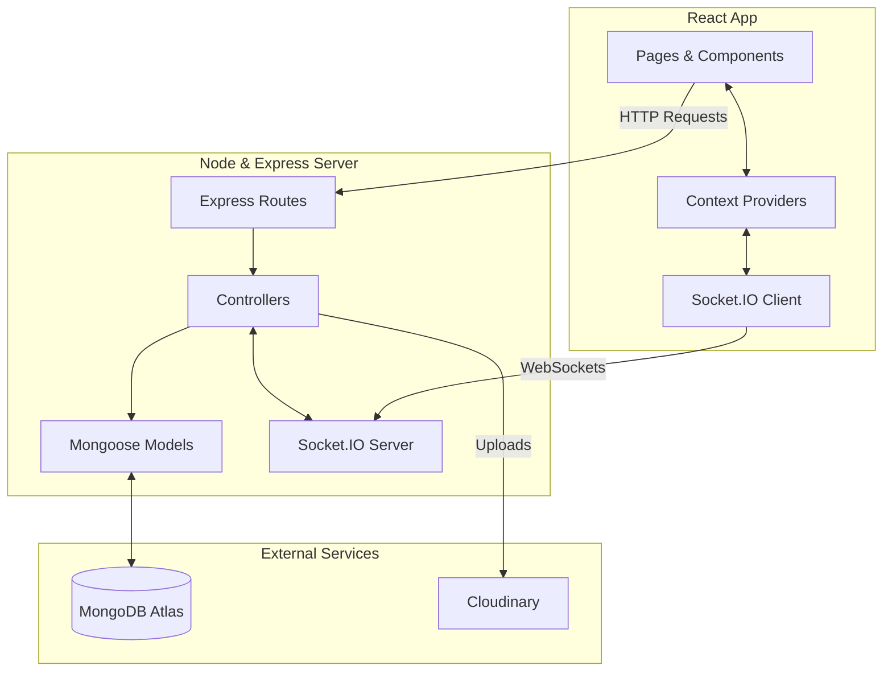

<](https://nodejs.org/)
  [](https://react.dev/)
  [](https://www.mongodb.com/atlas)
  [](https://socket.io/)
  [](https://tailwindcss.com/)
  [](LICENSE)

  **Gup Chup** is a full-stack, real-time messaging platform built with the **MERN stack** and **Socket.IO**. It delivers instant one-on-one and group conversations with rich media sharing, message management, and a sleek dark-themed interface — all in a responsive, mobile-friendly design.
  
  [Features](#-features) • [Screenshots](#-screenshots) • [Tech Stack](#-tech-stack) • [Getting Started](#-getting-started) • [API Reference](#-api-reference)

---

</div>

## ✨ Features

### 💬 Core Messaging
- **Real-Time Communication** — Instant message delivery powered by Socket.IO WebSockets.
- **One-on-One Chat** — Private, secure conversations between two users.
- **Group Chat** — Create and manage group conversations with multiple participants.
- **Message Editing & Deletion** — Edit sent messages (with an `(edited)` indicator) or delete them for everyone.

### 📁 Media & File Sharing
- **Rich Media Uploads** — Share photos, videos, and documents directly in the chat.
- **Cloud Storage** — All media files stored securely on **Cloudinary** (10 MB limit per file).

### 👤 User Management
- **Secure Authentication** — JWT-based authentication with 30-day token expiry and Bcrypt password hashing.
- **Profile Customization** — Update display name and profile picture.
- **User Search & Status** — Find users by name/mobile and track online status in real-time.

### 🎨 User Experience
- **Dark-Themed UI** — Elegant, modern dark interface built with Tailwind CSS.
- **Responsive Design** — Fully responsive layout for desktop, tablet, and mobile.
- **Read Receipts & Toast Notifications** — Know when messages are read and get non-intrusive feedback via React Hot Toast.

---

## 📸 Screenshots

> [!NOTE]
> *Add your application screenshots here to showcase the beautiful UI!*

| Login Screen | Chat Interface | Group Chat |
| :---: | :---: | :---: |
|  |  |  |

---

## 🛠 Tech Stack

<table>
  <tr>
    <td width="50%">
      <h3>Frontend</h3>
      <ul>
        <li><strong>React 19</strong> (UI components)</li>
        <li><strong>React Router v7</strong> (Routing)</li>
        <li><strong>Tailwind CSS 3</strong> (Styling)</li>
        <li><strong>Socket.IO Client</strong> (WebSockets)</li>
        <li><strong>Axios</strong> (HTTP client)</li>
        <li><strong>Lucide React</strong> (Icons)</li>
      </ul>
    </td>
    <td width="50%">
      <h3>Backend</h3>
      <ul>
        <li><strong>Node.js & Express 5</strong> (Server logic)</li>
        <li><strong>MongoDB + Mongoose 9</strong> (Database & ODM)</li>
        <li><strong>Socket.IO</strong> (Real-time engine)</li>
        <li><strong>JSON Web Tokens</strong> (Auth)</li>
        <li><strong>Bcrypt.js</strong> (Security)</li>
        <li><strong>Cloudinary</strong> (Media storage)</li>
      </ul>
    </td>
  </tr>
</table>

---

## 🚀 Getting Started

### Prerequisites

- **Node.js** v18+ & **npm** v9+
- **MongoDB Atlas** account (or local MongoDB)
- **Cloudinary** account (for image/video uploads)

### 1. Clone the Repository

```bash
git clone https://github.com/Avatars2/Gup-Chup.git
cd Gup-Chup
```

### 2. Backend Setup

```bash
cd backend
npm install
```

Create a `.env` file in the `backend/` directory:

```env
PORT=5000
MONGO_URI=your_mongodb_atlas_connection_string
JWT_SECRET=your_jwt_secret_key
CLOUDINARY_CLOUD_NAME=your_cloud_name
CLOUDINARY_API_KEY=your_api_key
CLOUDINARY_API_SECRET=your_api_secret
FRONTEND_URL=http://localhost:3000
```

Start the backend server:

```bash
npm run dev
```

> [!TIP]
> The backend runs on `http://localhost:5000` by default in development mode.

### 3. Frontend Setup

```bash
cd ../frontend
npm install
```

Create a `.env` file in the `frontend/` directory:

```env
REACT_APP_API_BASE_URL=http://localhost:5000/api
REACT_APP_SOCKET_URL=http://localhost:5000
```

Start the frontend development server:

```bash
npm start
```

Navigate to **http://localhost:3000** in your browser. Register a new account and start chatting!

---

<details>
<summary><h2>📡 API Reference (Click to expand)</h2></summary>

All API endpoints are prefixed with `/api`. Protected routes require an `Authorization: Bearer <token>` header.

### Authentication
- `POST /api/user/register` - Register a new user
- `POST /api/user/login` - Login with mobile & password
- `GET /api/user?search=` - Search users by name/mobile (Auth Required)
- `PUT /api/user/profile` - Update user profile (Auth Required)

### Chats
- `POST /api/chat` - Access or create 1-on-1 chat (Auth Required)
- `GET /api/chat` - Fetch all user's chats (Auth Required)
- `POST /api/chat/group` - Create a group chat (Auth Required)

### Messages
- `POST /api/message` - Send a new message (Auth Required)
- `GET /api/message/:chatId` - Get all messages for a chat (Auth Required)
- `PUT /api/message/edit` - Edit a sent message (Auth Required)
- `PUT /api/message/delete` - Soft-delete a message (Auth Required)
- `PUT /api/message/read` - Mark messages as read (Auth Required)

### File Upload
- `POST /api/upload` - Upload a file to Cloudinary

</details>

---

<details>
<summary><h2>🏗 Architecture & Project Structure (Click to expand)</h2></summary>

### System Architecture



### Directory Structure

```text
gup-chup/
├── backend/
│   ├── config/           # Database & third-party configs
│   ├── controllers/      # Route logic handlers
│   ├── middleware/       # Auth & error handlers
│   ├── models/           # Mongoose schemas
│   ├── routes/           # API endpoints
│   └── server.js         # Entry point
│
└── frontend/
    ├── public/           # Static assets
    └── src/
        ├── components/   # Reusable UI components
        ├── context/      # React context (Auth, Chat)
        ├── pages/        # Application views
        └── App.js        # Main application router
```
</details>

---

## 🌐 Deployment

**Backend (Vercel)**
```bash
cd backend
npx vercel --prod
```
*Don't forget to configure environment variables in your Vercel project settings.*

**Frontend (Vercel/Netlify)**
```bash
cd frontend
npm run build
```
*Update the `.env` variables to point to your deployed backend URL before building.*

---

## 🤝 Contributing

Contributions are welcome! Please follow these steps:
1. **Fork** the repository
2. **Create** a feature branch: `git checkout -b feature/amazing-feature`
3. **Commit** your changes: `git commit -m "Add amazing feature"`
4. **Push** to the branch: `git push origin feature/amazing-feature`
5. **Open** a Pull Request

---

## 📄 License

This project is licensed under the **MIT License** — see the [LICENSE](LICENSE) file for details.

<div align="center">
  <br />
  <strong>Built with ❤️ using the MERN Stack</strong><br/>
  <a href="#-gup-chup">⬆ Back to Top</a>
</div>
